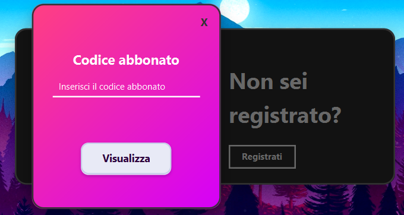
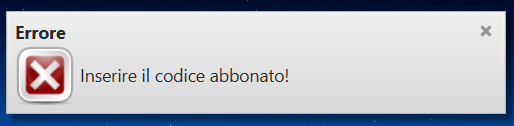
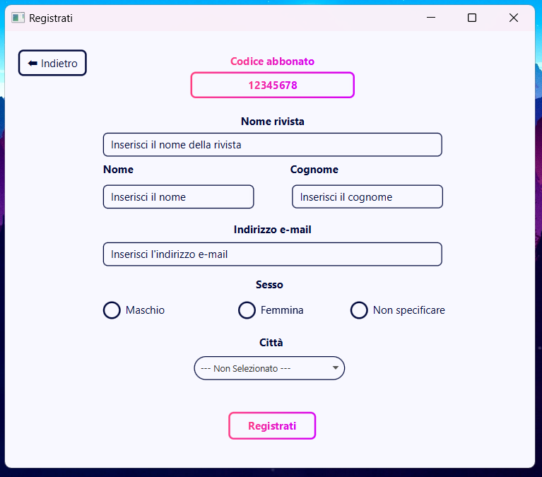
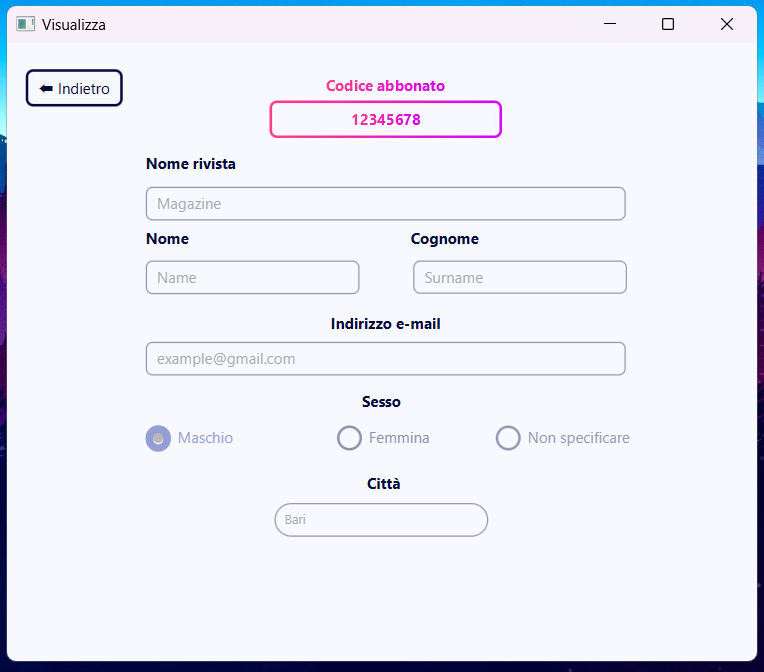

# 📚 Magazine Subscription Manager with JavaFX

A desktop application developed with **JavaFX** as a final project for the fourth year of high school. It allows users to manage magazine subscriptions through a simple and intuitive graphical interface. The entire interface is written in Italian 🇮🇹.

---

## 🚀 Overview

This application allows users, through entering a **subscription code**, to:
- View or add magazines they are subscribed to or want to subscribe to
- View the **subscriber’s personal information**

The app uses **ControlsFX** to enhance the user experience with **popup notifications**.

---

## 💻 How to Make It Work

### 📥 1. Clone the repository
```bash
git clone https://github.com/angiro22/Applicazione-gestione-abbonati-riviste
```

### 🧠 2. Open the project with your preferred IDE
> 🔧 Tip: use **IntelliJ IDEA** or **Eclipse**

---

### 🧾 3. Edit the `module-info.java` file

Path:
```
src/main/java/module-info.java
```

Change:
```java
requires java.desktop;
```

To:
```java
requires javafx.graphics;
```

> ☝️ This enables JavaFX support in your application.

---

### 📦 4. Add the `ControlsFX` library

#### IntelliJ IDEA:
- Go to `File » Project Structure...` (`Ctrl+Alt+Shift+S`)
- In `Project Settings`, click `Libraries`
- Press the `+` button → `Java`
- Select: `libs/controlsfx-11.2.0.jar`
- Click `Apply`, then `OK`

#### Eclipse:
- Go to `Project » Properties » Java Build Path`
- Select the `Libraries` tab
- Click `Add External JARs...`
- Choose: `libs/controlsfx-11.2.0.jar`
- Confirm with `Apply and Close`

---

## 🎉 5. Run the application

In IntelliJ or Eclipse go to the directory `src\main\java\com.example.gestioneabbonati` and run the `GestioneAbbonatiApplication.java` file.

## 🧪 System Requirements

- JDK 17+
- JavaFX SDK configured in the project
- `controlsfx-11.2.0.jar` present in the `libs/` folder

---

## 📁 Project Structure

```
src/
└── main/
    ├── java/
    │   ├── module-info.java
    │   └── com/example/gestioneabbonati/
    │       ├── GestioneAbbonatiApplication.java
    │       ├── HomeController.java
    │       ├── RegisterController.java
    │       ├── Subscriber.java
    │       ├── ViewController.java
    │       └── common/
    │           └── Methods.java
    └── resources/
        └── com/example/gestioneabbonati/
            ├── GUIHome.fxml
            ├── GUIRegister.fxml
            ├── GUIView.fxml
            └── styles/
                └── style.css
```

---

## 🧑‍🏫 Final Notes

This project was assigned by my Computer Science teacher as the final programming project for the fourth year of high school.  
Since I’m Italian, all GUI text and labels are in my native language.

---

## 🔍 How It Works

This application allows users to manage magazine subscriptions using a unique subscriber code.  
The main steps are illustrated below with example screenshots.

---

### 🏠 Home Page

On launch, the **Home Page** is shown, where users must enter their **subscriber code**.  
There are two buttons: `Registrati` and `Visualizza`.

The following validations are performed:
- Must be exactly **8 digits**
- Must be **numeric**
- Must **not be empty**

📌 Depending on the button clicked:
- If `Registrati`, the code **must not exist**
- If `Visualizza`, the code **must exist**



---

### ⚠️ Error Notifications

If any validation fails, an error message is shown using **ControlsFX notifications**.

Examples:
- “Please enter the subscriber code!”
- “The subscriber code already exists...”
- “The subscriber code does not exist...”



---

### 📝 Registration Page

If validations pass and the user clicked `Registrati`, they are redirected to the **registration page**.  
Here they must fill out personal information:

- Subscriber code (read-only)
- Magazine name
- Last name, First name, Email
- Gender (radio button)
- City (combo box)

🔍 All fields are **thoroughly validated**, for example:
- Email must contain exactly one `@`, a valid domain, and an allowed extension: `it`, `com`, `org`, `net`, `edu`
- Names cannot contain numbers
- A city must be selected

If all fields are valid:
- The data is saved into `abbonati.txt` (created if not present)
- The user is returned to the **Home Page**



---

### 📄 View Page

If the user clicked `Visualizza` and the code exists, the **view page** is shown.  
All subscriber data is displayed in **read-only fields**.

The information is read from `abbonati.txt` and loaded into the GUI.


