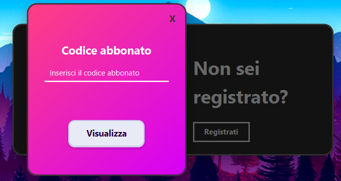
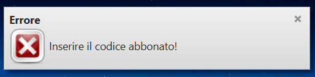
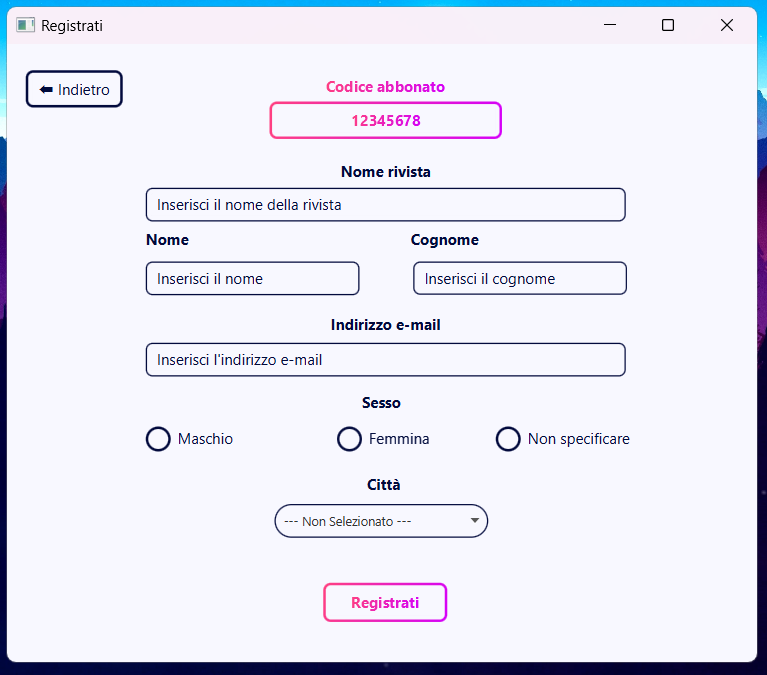
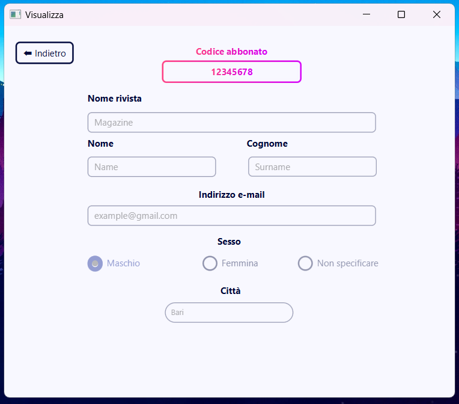

# Gestione abbonati riviste

Applicazione desktop sviluppata in JavaFX per la gestione degli abbonamenti a riviste, realizzata come progetto finale del quarto anno di scuola superiore. L'interfaccia grafica è interamente in italiano.

## Funzionalità

Tramite un codice abbonato di otto cifre, l'applicazione permette di:

- registrare un nuovo abbonato, con nome della rivista, dati anagrafici, indirizzo email e città;
- visualizzare i dati di un abbonato già registrato.

Le convalide impediscono la registrazione di un codice già esistente e la visualizzazione di un codice inesistente. Ogni campo del modulo di registrazione è controllato singolarmente: nome e cognome non possono contenere cifre, l'indirizzo email deve avere formato valido con una delle estensioni ammesse (it, com, org, net, edu), la città deve essere selezionata da un elenco. Gli errori di convalida e la conferma di registrazione sono mostrati con le notifiche di ControlsFX.

## Interfaccia

All'avvio compare la home page, dove si inserisce il codice abbonato e si sceglie tra registrazione e visualizzazione.



Se una convalida fallisce, l'errore è mostrato con una notifica di ControlsFX.



Dalla home, scegliendo di registrare un nuovo abbonato con un codice non ancora presente, si accede al modulo di registrazione.



Scegliendo di visualizzare un codice già registrato, i dati dell'abbonato sono mostrati in sola lettura.



## Tecnologie

- Java 17
- JavaFX, per l'interfaccia grafica e la navigazione tra le scene tramite FXML
- SQLite, tramite driver org.xerial:sqlite-jdbc, per la persistenza dei dati degli abbonati
- ControlsFX, per le notifiche popup
- Maven, per la gestione delle dipendenze e la build

## Struttura del progetto

```
src/main/java/
├── module-info.java
└── com/example/gestioneabbonati/
    ├── GestioneAbbonatiApplication.java
    ├── HomeController.java
    ├── RegisterController.java
    ├── ViewController.java
    ├── Subscriber.java
    └── common/
        ├── DatabaseManager.java
        └── Methods.java

src/main/resources/com/example/gestioneabbonati/
├── GUIHome.fxml
├── GUIRegister.fxml
├── GUIView.fxml
└── styles/style.css

database/
├── abbonati.db
└── schema.sql
```

`DatabaseManager` gestisce la connessione a SQLite e le operazioni di lettura e inserimento sulla tabella abbonati. Il file del database viene creato automaticamente al primo avvio, nella cartella `database` della directory di lavoro.

## Requisiti

- JDK 17 o superiore
- Maven

## Installazione e avvio

1. Clonare il repository:
   ```
   git clone https://github.com/angiro22/Applicazione-gestione-abbonati-riviste
   ```
2. Aprire il progetto con IntelliJ IDEA o Eclipse: Maven scarica ed aggiunge in automatico le dipendenze, incluso ControlsFX.
3. Avviare `GestioneAbbonatiApplication.java` dall'IDE, oppure da terminale:
   ```
   mvn javafx:run
   ```

## Note

Progetto assegnato dal docente di informatica come lavoro finale del quarto anno.